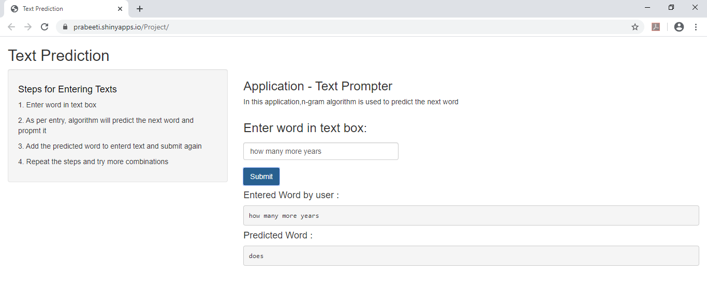

```{r setup, include=FALSE}
knitr::opts_chunk$set(echo = FALSE)
library(shiny)
```

## Introduction

The goal of this exercise is to create a product to highlight the prediction algorithm that I have built and to provide an interface that can be accessed by others. This is the final presentation in the Capstone Project. The project is build for English text. For this project I have submitted the following:-

- A Shiny app that takes as input a phrase (multiple words) in a text box input and outputs a prediction of the next word. https://prabeeti.shinyapps.io/Capstone_Project/
- A slide deck consisting of 5 slides created with R Studio Presenter http://rpubs.com/prabeeti/562534
- Source data for Project: https://d396qusza40orc.cloudfront.net/dsscapstone/dataset/Coursera-SwiftKey.zip
- Source Code:-GitHub at:https://github.com/prabeeti/CapstoneProject

## Data Exploration and building n-gram model

Data(English Text) is extracted from news, twitter and blogs to build a prediction algorithm. This data is provided by SwiftKey for an assignment. Following steps were taken:-

- Data is read into R (PredictionAlgorithm.R)
- For data cleaning few steps were taken like stripping out of numbers, punctuation, convert text to lowercase, removal of white space etc.
- Used bigrams, trigrams and quadgrams for this projects by creating n-grams. N-grams are sequence of items collected from a corpus.  The N refers to the number of items within the sequence.
- Metadata is saved in .rds file for unigrams, bigrams, trigrams and quadgrams

## Word Prediction

Katz back-off model is referred to model the next word prediction. This model is a generative n-gram language model that estimates the conditional probability of a word given its history in the n-gram. This process works as follows:

- Meta data is loaded from .RDS file (WordPrediction.R)
- First N-gram is used as quadgram, which takes the first three words that user has provided and predicts the text.
- If no match is found then the trigram is used,which takes the last two words of the user input and predicts the text.
- If there is still no match found, bigram is used next,which uses the last word of the user input. 
- When no match is found, the application will return a comment "Please try another word as unable to predict due to small sample size"

## Shiny App Screenshot
```{r}


```

- Thank You


